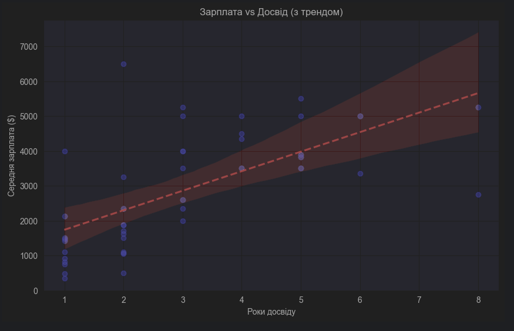
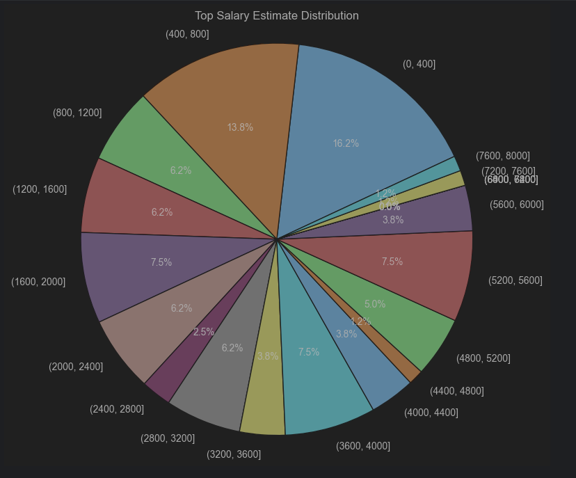
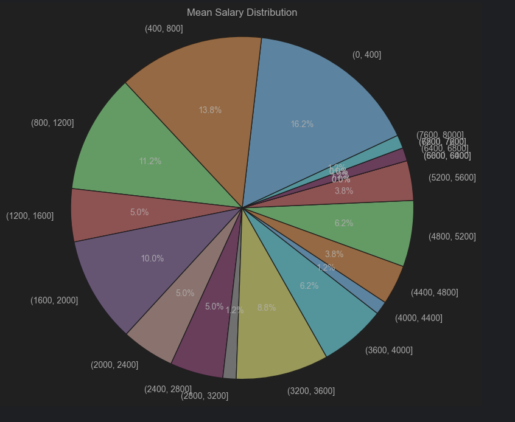
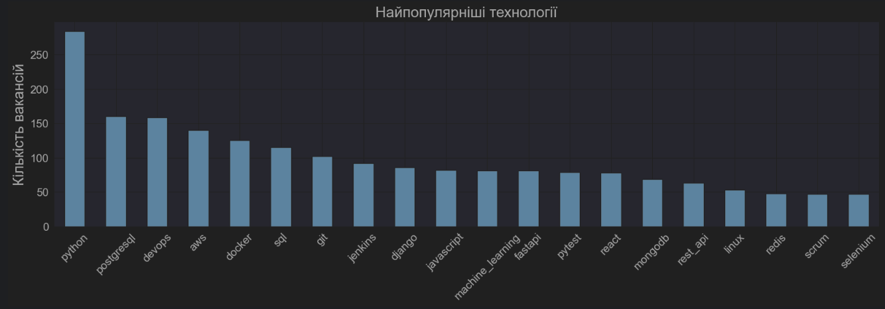
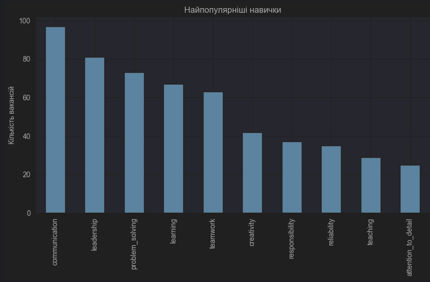
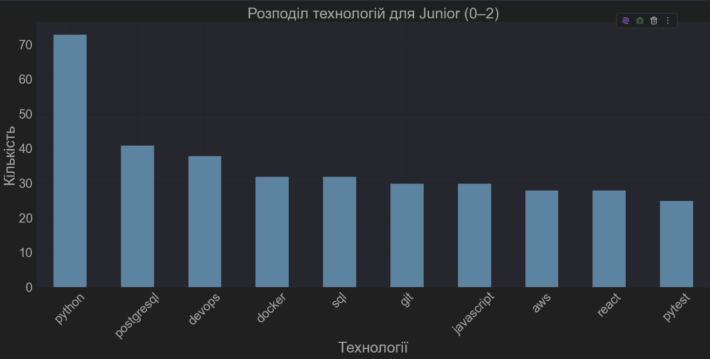
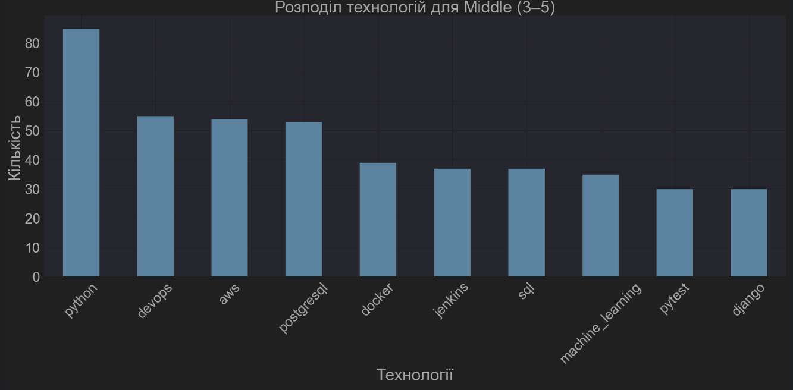
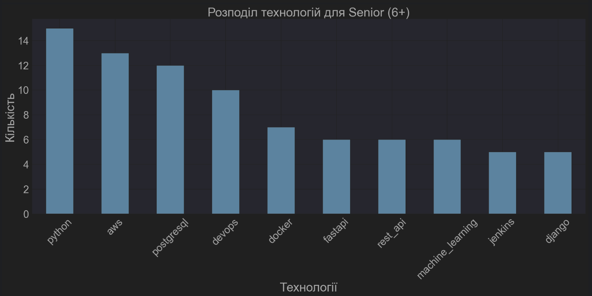
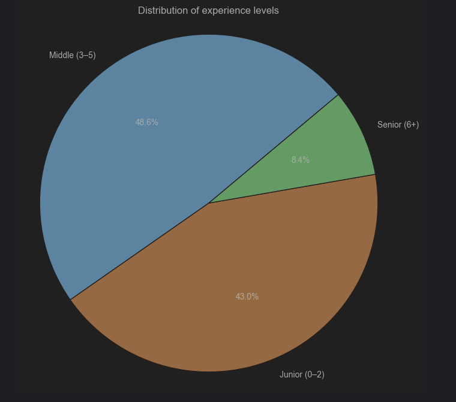

# Python Technology Statistics Project Requirements


   ## 📁 Project Overview


This project aims to collect, analyze, and visualize statistics on technology requirements in the Python job market.
It collects job postings from Ukrainian job sites (currently DOU.UA and Work.UA), extracts information about required
technologies, experience levels, and other job details, and provides tools to analyze this data.


   ## ✅ Functional Requirements


1. The system collects job ads from several Ukrainian job sites:


   * DOU.UA
   * Work.UA
   Possibility of adding other job sites in the future.


2. For each job posting, the system extracts:


   * Position
   * Company name
   * Location
   * Salary (if any)
   * Required experience
   * Job description
   * Publication date
   * Original job posting URL
   * Technologies mentioned in the description
   


      ## ⚙️ Features of the Implemented Functions


1. The application cleans and normalizes the extracted data:

   * Remove extra spaces and special characters.
   * Normalizes text formatting.
   * Process different formats of the same information (for example, different ways of defining experience).

2. The application classifies technologies mentioned in job descriptions:

   * Identify programming languages, frameworks, libraries, and tools.
   * Group related technologies.
   * Distinguish between technical skills (hard) and soft skills.

3. The application normalizes experience requirements:

   * Converts text descriptions to numeric values.
   * Processes descriptions in both English and Ukrainian.
   * Ignores irrelevant mentions of experience.

4. Converts salary to standard currency (USD) for comparison.


      ## 📂Data Storage


1. Data storage in a structured format:

   * CSV files for easy analysis.
   * Data caching to reduce website requests.
   * Counting and ranking technologies by frequency of mention.
   * Analysis of salary ranges for different technologies.
   * Analysis of experience requirements for different technologies.
   * Identifying trends over time.
   * Automatic logging of key events
   

    ## Data Analysis


1. Visualizing the results of the analysis:

   * Charts and graphs of technology popularity.
   * Salary distribution.
   * Experience level distribution.


    ## 🚀 Quick start of the project via Docker:


## 1. Clone the repository
```shell
  git clone https://github.com/romkapomka12/python-technologies-statistics
```
```shell
  cd python-technologies-statistics
```
## 2. Build the Docker image
```shell
  docker build -t job-parser .
```
## 3. Start the container
```shell
  docker run -p 8888:8888 job-parser
```
## 🌐 Access to results:

🐳 Docker specification:

* Automatically installs Chrome and Chromedriver
* Data is stored in the folder ./data/vacancies.csv
* Jupyter Notebook is available at: http://localhost:8888


      ## 🛠️ Manual launch (without Docker):

## 1.Create a virtual Python engine and activate it:
```shell
  python -m venv venv 
```
```shell
  source venv/bin/activate(on macOS)
```
```shell
  venv\Scripts\activate(on Windows)
```

## 2. Install dependencies:
```shell
  pip install -r requirements.txt
```

## 3. Run the parser:
```shell
  python main.py
```
Here are examples of charts using the matplotlib library:
 
markdown:


markdown:


markdown:


markdown:


markdown:


markdown:


markdown:


markdown:


markdown:
